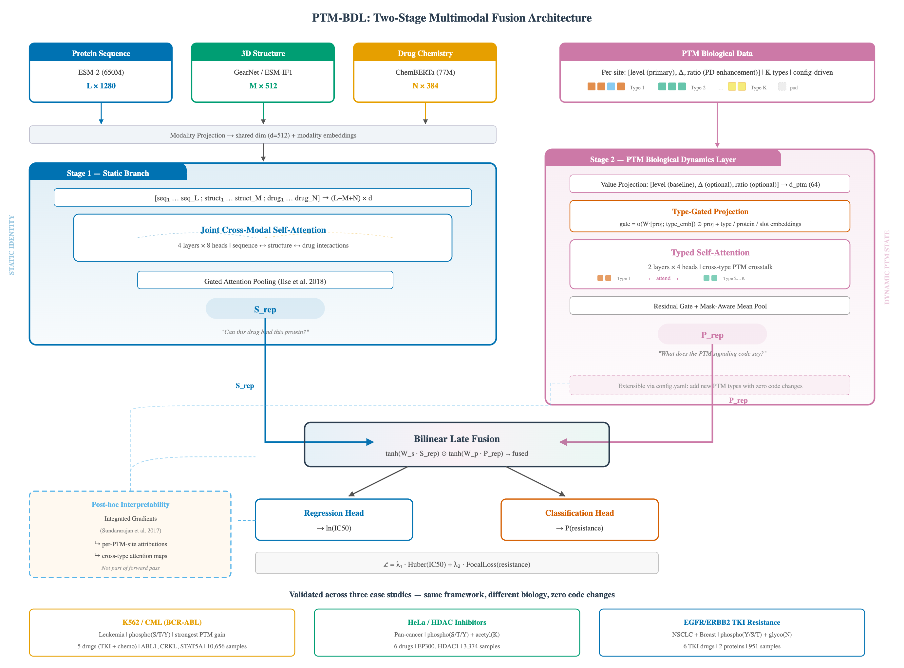

# PTM-BDL Framework

**A Post-Translational Modification Framework for Drug Response Prediction**

A config-driven, extensible deep learning framework that treats post-translational modifications (PTMs) as first-class
typed tokens in a self-attention architecture. The framework is protein-agnostic, PTM-type-agnostic, and drug-agnostic —
adding a new protein, PTM type, or drug requires only configuration changes.

[](https://www.python.org/downloads/)
[](LICENSE)
[](https://pytorch.org/)

---

## Architecture

<p align="center">
  
</p>
<p align="center">
  <em><strong>Figure 1.</strong> PTM-BDL multimodal architecture. <strong>Stage 1 (Static)</strong>: Protein sequence (ESM-2), 3D structure (GearNet), and drug chemistry (ChemBERTa) are projected into a shared space and processed by cross-modal self-attention to produce S<sub>rep</sub>. <strong>Stage 2 (Dynamic)</strong>: PTM sites are encoded as typed tokens [level, δ, ratio] with type-gated projection and inter-site self-attention to produce P<sub>rep</sub>. <strong>Fusion</strong>: Bilinear late fusion S<sub>rep</sub> ⊙ P<sub>rep</sub> feeds prediction heads for IC50 regression and resistance classification.</em>
</p>

---

## Overview

Drug resistance is determined by the **combinatorial PTM signaling code** — the pattern of which sites are
phosphorylated, glycosylated, or otherwise modified, how drugs change those patterns, and how different modification
types interact. PTM-BDL is the first neural module that encodes this biology through typed self-attention over PTM
tokens, enabling the model to discover inter-site signaling dependencies and cross-type crosstalk.

### Two Architectural Contributions

1. **Multimodal Cross-Modal Self-Attention** — Protein sequence (ESM-2), 3D structure (GearNet), and drug chemistry (
   ChemBERTa) are jointly learned through cross-modal self-attention, producing a static protein-drug representation (
   S_rep).

2. **PTM Biological Dynamics Layer (PTM-BDL)** — A typed self-attention encoder that accepts any number of PTM types,
   each with any number of subtypes. Each PTM site becomes a typed token encoded as `[level, delta, ratio]`, processed
   through type-gated projection and inter-site self-attention to produce a dynamic PTM representation (P_rep).

**Fusion**: `S_rep ⊙ P_rep` — "Given the drug CAN bind (S_rep), does the PTM signaling code say it WORKS? (P_rep)"

### Case Studies

| Case Study | Status | Proteins | PTM Types | Drugs | Cancer | Data |
|------------|--------|----------|-----------|-------|--------|------|
| **EGFR/ERBB2 TKI Resistance** | ✅ Complete | EGFR, HER2 | phospho (Y/S/T) + glyco (N) | 6 TKIs | NSCLC + Breast | 3.8M rows |
| **HeLa / HDAC Inhibitors** |  ✅ Complete | HDAC1, EP300 | phospho (S/T/Y) + **acetyl (K)** | 6 drugs | Cervical (pan-cancer) | 93K summaries |
| **K562 / CML (BCR-ABL)** | ✅ Complete | ABL1, CRKL, STAT5A | phospho (S/T/Y) | 5 drugs (TKI + chemo) | CML (leukemia) | 78K summaries |

Each case study proves the framework generalizes to a different drug mechanism, cancer type, and PTM type — with **zero
framework code changes**.

---

## Project Structure

```
PTM-BDL-Framework/
│
├── src/ptm_bdl/                        # CORE FRAMEWORK (protein-agnostic)
│   ├── registry.py                     # Config-driven PTM type/subtype system
│   ├── model/                          # encoder, ablation, static, fusion, predictor
│   ├── data/                           # dataset, collate, splits
│   ├── training/                       # loss, trainer, metrics, factory, checkpoint, device, sampler
│   ├── evaluation/                     # evaluator, baselines, statistical, loclo, loader
│   └── xai/                            # integrated_gradients, attention, homology
│
├── src/case_studies/                   # CASE STUDY INSTANCES
│   ├── common/                         # Shared data pipeline utilities (GDSC, structures, PTM)
│   ├── egfr_erbb2_tki/                # CS1: EGFR/ERBB2 TKI Resistance (complete)
│   │   ├── biology.py                  # Application-specific biological constants
│   │   ├── data_pipeline/              # Steps 01-06: data acquisition + harmonization
│   │   ├── features/                   # Steps 07-09: ESM-2, GearNet, ChemBERTa
│   │   └── scripts/                    # Steps 10-15: train, evaluate, explain, benchmark
│   ├── hela_hdac/                      # CS2: HeLa/HDAC Inhibitors (complete)
│   │   ├── biology.py                  # HDAC/HAT drug classifications + PDB structures
│   │   ├── data_pipeline/              # Steps 01-06 (phospho + NEW acetyl_K PTM type)
│   │   ├── features/                   # Steps 07-09: ESM-2, GearNet, ChemBERTa
│   │   └── scripts/                    # train, evaluate, explain, ablation, crossval, etc.
│   └── k562_cml/                       # CS3: K562/CML BCR-ABL (complete)
│       ├── biology.py                  # BCR-ABL substrates + TKI/chemo classifications
│       ├── data_pipeline/              # Steps 01-06 (5 drugs: 2 TKI + 3 chemo)
│       ├── features/                   # Steps 07-09: ESM-2, GearNet, ChemBERTa
│       └── scripts/                    # train, evaluate, explain, ablation, crossval, etc.
│
├── tests/                              # pytest test suite
├── docs/                               # Architecture docs, evaluation, data guide
└── results/                            # Evaluation outputs + publication figures
```

---

## Quick Start

### Prerequisites

- **Python 3.11** (required — tested with 3.11.9; must be ≥ 3.11 and < 3.13)
- **Git**
- **~4 GB disk space** for pretrained model weights (downloaded on first run)
- **~1 GB disk space** for raw data files (see [Data Download](#4-download-raw-data) below)
- **HuggingFace account** — Steps 07 and 09 download pretrained models (ESM-2, ChemBERTa) from HuggingFace Hub

### 1. Clone the Repository

```bash
git clone https://github.com/Moustafazn/PTM-BDL-Framework.git
cd PTM-BDL-Framework
```

### 2. Create Virtual Environment (Python 3.11)

```bash
# Create venv with Python 3.11
python3.11 -m venv .venv

# Activate the virtual environment
source .venv/bin/activate          # macOS / Linux
# .venv\Scripts\activate           # Windows
```

### 3. Install Dependencies

```bash
# Install all core dependencies
pip install -r requirements.txt

# Install PyTorch Geometric (requires matching torch version — must be installed separately)
pip install torch-geometric -f https://data.pyg.org/whl/torch-2.12.0+cpu.html

# Install the project in editable mode
pip install -e ".[dev]"
```

> **Why is `torch-geometric` installed separately?**
> PyTorch Geometric requires a wheel that matches your exact PyTorch version and platform.
> It cannot be installed via a standard `pip install -r requirements.txt` — the `-f` flag
> points pip to the correct version-matched wheel index.
>
> **If `pip install -r requirements.txt` tries to upgrade torch and times out**, install
> the missing packages individually instead:
> ```bash
> pip install fair-esm biotite xgboost
> pip install torch-geometric -f https://data.pyg.org/whl/torch-2.12.0+cpu.html
> ```

### 4. Download Raw Data

Raw data files must be downloaded manually before running the pipeline.
See [`docs/DATA_DOWNLOAD_GUIDE.md`](docs/DATA_DOWNLOAD_GUIDE.md) for complete instructions.

**Quick option** — download the pre-packaged archive:
```bash
# Download from GitHub Releases and extract:
tar -xzf data_raw.tar.gz
```

**Required data sources:**

| Source | Files | Size | Place In |
|--------|-------|------|----------|
| [GDSC2 (Sanger)](https://cellmodelpassports.sanger.ac.uk/downloads) | IC50 dose-response + model list | ~22 MB | `data/raw/gdsc/` |
| [DepMap (Broad)](https://depmap.org/portal/data_page/?tab=allData) | Somatic mutations + model info | ~900 MB | `data/raw/ccle/` |
| [UniProt](https://www.uniprot.org) | EGFR/HER2 FASTA + PTM JSON | ~1 MB | `data/raw/ccle/`, `data/raw/ptm/` |
| [RCSB PDB](https://www.rcsb.org) | Crystal structures (11 PDB files) | ~10 MB | `data/raw/pdb/` |
| [DrugPTM-Bench](https://github.com/Xie-lab/DrugPTM-Bench) | Cell line phosphoproteomics | ~3 GB | `data/raw/drugptm/` |

### 5. HuggingFace Setup (for pretrained model downloads)

Steps 07 (ESM-2) and 09 (ChemBERTa) download pretrained models from HuggingFace Hub.
To avoid rate limits and enable faster downloads:

1. **Create a HuggingFace account**: https://huggingface.co/join
2. **Accept model licenses** (visit each page and click "Agree"):
   - ESM-2: https://huggingface.co/facebook/esm2_t33_650M_UR50D
   - ChemBERTa: https://huggingface.co/DeepChem/ChemBERTa-77M-MTR (public, no gate)
3. **Create an access token**: https://huggingface.co/settings/tokens → "New token" → "Read"
4. **Login** (run once):
   ```bash
   hf auth login
   # Paste your token when prompted
   ```

> **Note**: If you skip this step, the pipeline will still run but with unauthenticated
> requests (slower downloads, rate limits). Steps 07 and 09 will NOT crash.

### 6. Pre-Download Pretrained Models (optional but recommended)

Steps 07 and 09 automatically download models on first run, but you can pre-cache them
to avoid delays during pipeline execution:

```bash
# Pre-download ESM-2 (protein language model, ~2.5 GB)
hf download facebook/esm2_t33_650M_UR50D

# Pre-download ChemBERTa (drug embedding model, ~300 MB)
hf download DeepChem/ChemBERTa-77M-MTR
```


> **Step 08 structural embeddings** tries three backends in order:
> 1. **ESM-IF1** (best — pretrained GVP encoder): requires `fair-esm` + `biotite`
> 2. **PyG GNN** (good — trainable Xavier-init GNN): requires `torch-geometric`
> 3. **Basic fallback** (functional — Xavier-initialized GNN): only needs `torch` + `biopython`
>
> For best results, all three packages should be installed (step 3 above).

### Docker (recommended for reproducibility)

```bash
docker compose up                        # Run ALL case studies
docker compose --profile egfr up         # EGFR/ERBB2 only
docker compose --profile hela up         # HeLa/HDAC only
docker compose --profile k562 up         # K562/CML only
docker compose --profile test up         # Test suite
docker compose run shell                 # Interactive shell
```

---

## Running Case Studies

### Using Make (simplest)

```bash
make egfr        # CS1: EGFR/ERBB2 TKI Resistance (NSCLC + breast)
make hela        # CS2: HeLa/HDAC Inhibitors (phospho + acetyl)
make k562        # CS3: K562/CML BCR-ABL (TKI + chemo)
make all         # All three case studies
```

Run individual phases for a specific case study:

```bash
make data CASE=hela         # Steps 01-05: download + process data
make harmonize CASE=hela    # Step 06: build multimodal dataset
make features CASE=hela     # Steps 07-09: extract ESM-2, GearNet, ChemBERTa
make train CASE=hela        # Train + ablation + cross-validation
make evaluate CASE=hela     # Evaluation + XAI
make benchmark CASE=hela    # ML baselines + external methods + LOCLO
make figures CASE=hela      # Publication figures + tables
```

### Running Step-by-Step

Each case study has its own complete pipeline. Replace `<cs>` with the case study module name:
- `egfr_erbb2_tki` — EGFR/ERBB2 TKI resistance
- `hela_hdac` — HeLa/HDAC inhibitors
- `k562_cml` — K562/CML BCR-ABL

**Data Pipeline (Steps 01-06):**

```bash
python -m src.case_studies.<cs>.data_pipeline.step01_download_gdsc
python -m src.case_studies.<cs>.data_pipeline.step02_download_sequences
python -m src.case_studies.<cs>.data_pipeline.step03_download_structures
python -m src.case_studies.<cs>.data_pipeline.step04_download_ptm_data
python -m src.case_studies.<cs>.data_pipeline.step05_download_drugptm
python -m src.case_studies.<cs>.data_pipeline.step06_harmonize_dataset
```

**Feature Extraction (Steps 07-09):**

```bash
python -m src.case_studies.<cs>.features.step07_extract_esm2       # ESM-2 protein embeddings (uses transformers)
python -m src.case_studies.<cs>.features.step08_extract_gearnet    # Structural embeddings (uses fair-esm/biotite/PyG)
python -m src.case_studies.<cs>.features.step09_extract_chemberta  # ChemBERTa drug embeddings (uses transformers)
```

**Analysis & Evaluation:**

```bash
python -m src.case_studies.<cs>.scripts.train              # Train PTM-BDL model
python -m src.case_studies.<cs>.scripts.evaluate           # Comprehensive evaluation
python -m src.case_studies.<cs>.scripts.explain            # XAI (IG + attention)
python -m src.case_studies.<cs>.scripts.ablation           # Modality ablation study
python -m src.case_studies.<cs>.scripts.crossval           # K-fold cross-validation
python -m src.case_studies.<cs>.scripts.ml_baselines       # ML baseline comparison
python -m src.case_studies.<cs>.scripts.external_baselines # Published methods
python -m src.case_studies.<cs>.scripts.statistical_tests  # Bootstrap CIs
python -m src.case_studies.<cs>.scripts.loclo              # LOCLO generalization
python -m src.case_studies.<cs>.scripts.paper_figures      # Publication figures
python -m src.case_studies.<cs>.scripts.paper_tables       # Publication tables
```

---

## Using PTM-BDL as a Package

After publication, PTM-BDL can be installed and used in any Python project:

### Installation

```bash
pip install ptm-bdl-framework
# or from source:
pip install git+https://github.com/Moustafazn/PTM-BDL-Framework.git
```

### Model Input/Output Specification

**Inputs** (all tensors, batch dimension B):

| Input                | Shape              | Type    | Description                                       |
|----------------------|--------------------|---------|---------------------------------------------------|
| `seq_embeddings`     | (B, L, 1280)       | float32 | ESM-2 per-residue protein embeddings              |
| `struct_embeddings`  | (B, M, 512)        | float32 | GearNet per-residue structural embeddings         |
| `drug_pooled`        | (B, 384)           | float32 | ChemBERTa pooled drug embedding                   |
| `drug_embeddings`    | (B, N, 384)        | float32 | ChemBERTa per-token drug embeddings (optional)    |
| `ptm_vector`              | (B, n_tokens)          | float32 | Flat PTM baseline occupancy (all types concatenated, 1.0 = wild-type) |
| `delta_ptm_vector`        | (B, n_tokens)          | float32 | Flat drug-induced PTM change (all types concatenated, 0.0 = no drug)  |
| `target_protein`          | (B,)                   | long    | Protein ID index (0, 1, 2, ...)                           |

**Outputs**:

| Output              | Shape  | Type    | Description                                       |
|---------------------|--------|---------|---------------------------------------------------|
| `ic50_pred`         | (B, 1) | float32 | Predicted ln(IC50) drug sensitivity               |
| `resistance_logits` | (B, 1) | float32 | Resistance logits (apply sigmoid for probability) |

### Minimal Example — Build, Train, Predict

```python
import torch
import yaml
from src.ptm_bdl.training import build_model_from_cfg, FocalLoss, train_epoch, validate
from src.ptm_bdl.evaluation.evaluator import collect_predictions, compute_full_metrics

# 1. Load config (framework + case study settings)
with open("config/config.yaml") as f:
    cfg = yaml.safe_load(f)

# 2. Build model — all PTM types, subtypes, and embeddings auto-configured
model = build_model_from_cfg(cfg)
print(f"Model: {sum(p.numel() for p in model.parameters()):,} parameters")

# 3. Prepare a single sample (example dimensions)
#    All PTM types are concatenated into a single flat ptm_vector.
#    E.g., 12 phospho + 12 glyco = 24 tokens total.
n_tokens = 24  # from registry.n_tokens
sample = {
    "seq_emb": torch.randn(1, 100, 1280),       # ESM-2 protein embeddings
    "struct_emb": torch.randn(1, 80, 512),       # GearNet structural embeddings
    "drug_pooled": torch.randn(1, 384),           # ChemBERTa pooled
    "drug_emb": torch.randn(1, 20, 384),          # ChemBERTa per-token
    "ptm_vector": torch.ones(1, n_tokens),        # Flat PTM baseline (all types)
    "delta_ptm_vector": torch.zeros(1, n_tokens), # Drug-induced PTM change (all types)
    "target_protein": torch.tensor([0]),           # Protein ID (0=first protein)
}

# 4. Forward pass
model.eval()
with torch.no_grad():
    ic50_pred, resistance_logits = model(
        seq_embeddings=sample["seq_emb"],
        struct_embeddings=sample["struct_emb"],
        drug_pooled=sample["drug_pooled"],
        drug_embeddings=sample["drug_emb"],
        ptm_vector=sample["ptm_vector"],
        delta_ptm_vector=sample["delta_ptm_vector"],
        target_protein=sample["target_protein"],
    )

print(f"Predicted ln(IC50): {ic50_pred.item():.3f}")
print(f"P(resistance): {torch.sigmoid(resistance_logits).item():.3f}")

# 5. Training loop (with your DataLoader)
focal_loss = FocalLoss(alpha=0.25, gamma=2.0)
optimizer = torch.optim.AdamW(model.parameters(), lr=1e-4)
scheduler = torch.optim.lr_scheduler.CosineAnnealingLR(optimizer, T_max=100)

# train_epoch handles one full epoch:
train_loss = train_epoch(model, train_loader, optimizer, scheduler,
                         focal_loss, lambda_reg=1.0, lambda_cls=2.0, device="cpu")

# validate returns comprehensive metrics:
val_metrics = validate(model, val_loader, focal_loss, 1.0, 2.0, "cpu")
print(f"Val AUROC: {val_metrics['auroc']:.3f}, BAcc: {val_metrics['balanced_acc']:.3f}")
```

### Framework Utilities — Training & Evaluation

The framework provides shared utilities that ensure consistent behavior across all case studies:

```python
from src.ptm_bdl.training import (
    compute_optimal_threshold,
    save_checkpoint, load_checkpoint,
    resolve_device, create_balanced_sampler,
)
from src.ptm_bdl.evaluation.evaluator import (
    collect_predictions, compute_full_metrics,
    load_threshold, make_eval_loader,
)

# ── Device selection (auto-detects CUDA > MPS > CPU) ──
device = resolve_device(cfg)

# ── Class-balanced sampling (prevents majority-class collapse) ──
sampler = create_balanced_sampler(dataset, train_idx)
train_loader = DataLoader(train_set, batch_size=16, sampler=sampler, collate_fn=collate_fn)

# ── Save/load checkpoints (always uses weights_only=True) ──
save_checkpoint(model, "data/models/best_model.pt")
load_checkpoint(model, "data/models/best_model.pt", device)  # loads + sets eval mode

# After training — compute optimal classification threshold (Youden's J)
# Finds the probability threshold that maximizes (sensitivity + specificity)
# on the validation set. Essential when focal loss shifts probabilities away from 0.5.
# Ref: Youden WJ (1950) Cancer 3:32-35.
threshold_info = compute_optimal_threshold(model, val_loader, device)
# Returns: {"optimal_threshold": 0.38, "method": "Youden_J", "reference": "..."}

# During evaluation — load the saved threshold
threshold = load_threshold(model_dir)  # Loads optimal_threshold.json, falls back to 0.5

# Create evaluation DataLoaders from index arrays (consistent across all scripts)
loader = make_eval_loader(dataset, test_idx, batch_size=32, collate_fn=collate_fn)

# Collect predictions and compute metrics with calibrated threshold
y_true_ic50, y_pred_ic50, y_true_cls, y_prob_cls = collect_predictions(model, loader)
regression, classification = compute_full_metrics(
    y_true_ic50, y_pred_ic50, y_true_cls, y_prob_cls,
    threshold=threshold,
)
```

### Using the PTMTypeRegistry Directly

```python
from src.ptm_bdl.registry import PTMTypeRegistry

# Build registry from config
registry = PTMTypeRegistry.from_config(cfg)

# Query the registry
print(f"PTM subtypes: {registry.n_subtypes}")    # e.g. 4
print(f"Tokens per sample: {registry.n_tokens}")  # e.g. 24 (12 primary + 12 secondary)
print(f"Proteins: {registry.protein_names}")       # e.g. ['PROTEIN_A', 'PROTEIN_B']
print(f"Subtype names: {registry.subtype_names}")  # e.g. {0: 'primary_Y', 1: 'primary_S', ...}

# Get site labels for XAI reporting
labels = registry.get_flat_site_labels(registry.protein_names[0])
print(f"Sites: {labels[:5]}")

# Get buffer tensors (used by the encoder)
print(f"Type ID table shape: {registry.type_id_table.shape}")  # (2, 24)
print(f"Is-real table shape: {registry.is_real_table.shape}")  # (2, 24)
```

### Adding a New Case Study (Separate Project)

To use PTM-BDL in your own project for a different biological system:

```python
# your_project/train_my_model.py
import yaml
from src.ptm_bdl.training import build_model_from_cfg, FocalLoss, train_epoch, validate
from src.ptm_bdl.data import ResistanceDataset, collate_fn

# Your config defines YOUR proteins, PTM types, and drugs
my_config = {
    "model": {"shared_dim": 512, "num_joint_attention_layers": 4,
              "num_attention_heads": 8, "dropout": 0.1,
              "learning_rate": 1e-4, "weight_decay": 1e-5,
              "batch_size": 16, "num_epochs": 100, "early_stopping_patience": 15},
    "ptm_bdl": {"d_model": 64, "n_heads": 4, "n_layers": 2},
    "ptm": {
        "ptm_dim": 10,  # YOUR number of primary PTM sites
        "secondary_dim": 8,  # YOUR number of secondary PTM sites (0 or omit if none)
        # Also accepts "glyco_dim" (legacy alias for secondary_dim)
        "YOUR_PROTEIN": {
            "phospho_sites": [
                {"position": 100, "residue": "Y100", "amino_acid": "Y", "function": "kinase substrate"},
                # ... your primary PTM sites (first *_sites key → primary channel)
            ],
            # Optional secondary channel — ANY additional *_sites key:
            # "acetyl_sites": [   # acetylation
            #     {"position": 200, "residue": "K200", "amino_acid": "K", "function": "regulatory"},
            # ],
            # "glyco_sites": [    # glycosylation
            #     {"position": 50, "residue": "N50", "amino_acid": "N", "function": "extracellular"},
            # ],
        },
    },
}

# Build model — auto-configures for YOUR proteins and PTM types
model = build_model_from_cfg(my_config)

# Train on YOUR data using the same training infrastructure
# ... (same API as above)
```

**The framework requires ZERO code changes to support your biological system.**

---

## Configuration

Framework-level settings are in `src/ptm_bdl/default_config.yaml` (shipped with the package).
Case-study-specific settings are in each case study's `config.yaml`.

```python
from src.ptm_bdl.config import load_config

# Load merged config (base framework + EGFR/ERBB2 case study)
cfg = load_config(case_study="egfr_erbb2_tki")

# Load base framework config only
cfg = load_config(case_study=None)
```

**Framework defaults** (`src/ptm_bdl/default_config.yaml`):

```yaml
model:
  shared_dim: 512
  num_joint_attention_layers: 4
  num_attention_heads: 8
  learning_rate: 1.0e-4
  batch_size: 16

ptm_bdl:
  d_model: 64
  n_heads: 4
  n_layers: 2

training:
  seed: 42
  train_ratio: 0.7
  val_ratio: 0.15
  device: "auto"  # "auto" selects best available: cuda > mps > cpu
```

**Case-study-specific settings** (proteins, drugs, PTM sites, tissue filters) are in
`src/case_studies/egfr_erbb2_tki/config.yaml`. The `load_config` function deep-merges both configs automatically.

---

## Dependencies

All dependencies are required for the full pipeline. Install with `pip install -r requirements.txt`.

| Package | Version | Used By | Purpose |
|---------|---------|---------|---------|
| Python | ≥ 3.11, < 3.13 | All | Language runtime |
| PyTorch | ≥ 2.1 | Steps 07-09, training | Deep learning backend |
| transformers | ≥ 4.36 | Steps 07, 09 | ESM-2 protein + ChemBERTa drug model loading |
| fair-esm | ≥ 2.0 | Step 08 | ESM-IF1 pretrained structural encoder |
| biotite | ≥ 1.0 | Step 08 | PDB parsing for ESM-IF1 |
| torch-geometric | ≥ 2.4 | Step 08 | PyG GearNet structural GNN (separate install) |
| biopython | ≥ 1.84 | Steps 02-03, 08 | FASTA/PDB parsing |
| scikit-learn | ≥ 1.3 | Evaluation | Metrics, data splits, ML baselines |
| xgboost | ≥ 2.0 | ML baselines | Gradient boosting comparison |
| pandas | ≥ 2.0 | Steps 01-06 | Data processing |
| openpyxl | ≥ 3.1 | Steps 01, 04-05 | Excel file reading |

See [`pyproject.toml`](pyproject.toml) for the full list.

> **Note on `torch-geometric`**: This package must be installed separately after PyTorch because
> it requires a version-matched wheel. See [installation step 3](#3-install-dependencies) above.

---

## Documentation

| Document                                                       | Description                                      |
|----------------------------------------------------------------|--------------------------------------------------|
| [`docs/DATA_DOWNLOAD_GUIDE.md`](docs/DATA_DOWNLOAD_GUIDE.md)  | Manual data download instructions (per-step, per-source) |

---

## Tests

```bash
make test
# or
python -m pytest tests/ -v --tb=short
```

---

## Citation

```bibtex
@software{zein2026ptmbdl,
  title  = {Multimodal Self-Attention with {PTM} Biological Dynamics Layer:
            A {PTM} Framework for Drug Response Prediction},
  author = {Zein, Moustafa and Hassanien, Aboul Ella},
  year   = {2026},
  url    = {https://github.com/Moustafazn/PTM-BDL-Framework},
}
```

## License

MIT License — see [LICENSE](LICENSE).
